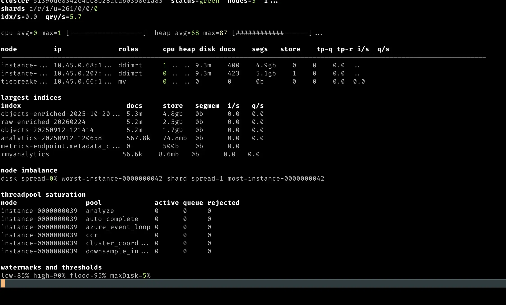

# ktsearch-cli

`ktsearch-cli` is a multiplatform command line tool for
Elasticsearch and OpenSearch operations based on `kt-search`.
It supports Elasticsearch `7-9` and OpenSearch `1-3`, with
installable native binaries for macOS/Linux and Bash/Zsh
completion.

The full command reference is generated in
[`cli-manual.md`](./cli-manual.md).

## Install with Homebrew

Install the `ktsearch` command from the dedicated
Homebrew tap:

```bash
brew tap jillesvangurp/tap https://github.com/jillesvangurp/homebrew-tap
brew install ktsearch
```

Bash and Zsh completions are installed automatically.

## Why native binaries

A key advantage of `kt-search` being multiplatform is that
`ktsearch-cli` ships as native binaries on macOS and Linux.

- Easy installation
- No runtime dependencies
- Fast startup
- Easy to script
- Easy to use for agentic coding workflows

## How this works

The CLI is a thin layer on top of `kt-search`.
It uses [Clikt](https://ajalt.github.io/clikt/) for
command-line parsing and [Okio](https://square.github.io/okio/)
for native I/O.

## Quick command map

Use this as a high-level map. For full command syntax,
flags, and more examples, see
[`cli-manual.md`](./cli-manual.md).

- `ktsearch cluster ...` for health, stats, state, and settings.
- `ktsearch top` for live cluster/node vitals and admin panels.
- `ktsearch cat ...` for table/csv operational views.
- `ktsearch cloud elastic ...` for cloud context, check, and status helpers.
- `ktsearch tasks status|wait ...` for task inspection and task polling.
- `ktsearch index create|get|refresh|delete|search ...` for index-level operations.
- `ktsearch index mappings/settings/template ...` for schema and template management.
- `ktsearch index alias ...` and `ktsearch index data-stream ...` for routing/data stream tasks.
- `ktsearch index snapshot ...`, `reindex ...`, and `ilm ...` for maintenance workflows.
- `ktsearch index dump|restore ...` for NDJSON export/import.

Example `ktsearch top` dashboard output:



Commands that modify or delete data ask for confirmation
by default. Use `--yes` in automation.

## Reindex behavior notes

`ktsearch index reindex` defaults to `--wait false` and
returns the task response immediately.

- Use `--progress-reporting` to keep polling and print a single-line progress view (percent, docs, batches, rate, ETA).
- If you use `--disable-refresh-interval` or `--set-replicas-zero`, the CLI keeps polling until the task completes so temporary destination settings can be restored safely (these flags imply progress reporting).
- Temporary destination settings are restored to prior values (or defaults if they were unset).

## Native build limitations

Native support in Kotlin/Native and dependency toolchains
keeps improving, and some limits below may change in
future releases.

- Main focus is reliable support for `macosArm64`, `macosX64`, and `linuxArm64`.
- `linuxX64` is supported and cross-built on macOS by default; disable it with `-Pktsearch.disableLinuxTargetsOnMac=true`.
- Direct host cross-builds for `linuxArm64` on macOS may still fail at link time due to `ktor-client-curl`/OpenSSL linker issues.
- Building Apple final binaries on Linux CI is not supported by Kotlin/Native host restrictions.
- Windows `mingwX64` binaries can be built, but Windows ARM64 is not available as a Kotlin/Native target today.
- For now, the easiest way to get a native binary for your system is to run the build on that same system via `./ktsearch-cli/install.sh`.
- Prebuilt packaging and CI-produced binaries may be added later if this stabilizes.

## Wasm builds (experimental)

`ktsearch-cli` has experimental WebAssembly support.

- `wasmJs` status: supported as an opt-in target (`-Pktsearch.enableWasmCli=true`) and runnable with Node.js.
- Build optimized wasm executable artifacts:
- `./gradlew :ktsearch-cli:compileProductionExecutableKotlinWasmJs -Pktsearch.enableWasmCli=true`
- Run from Node.js:
- `./gradlew :ktsearch-cli:wasmJsNodeProductionRun -Pktsearch.enableWasmCli=true`
- `wasmJs` limitation: platform I/O is partial. Commands that require local file read/write or gzip dump/restore are not supported yet.
- `wasmWasi` status: not supported yet in this project.
- `wasmWasi` blocker: WASI runtimes (for example `wasmtime`) are not wired yet. That would require adding a `wasmWasi` target plus platform I/O implementations.

## Install / uninstall

Use the scripts from the repository root:

```bash
println("./ktsearch-cli/install.sh")
println("./ktsearch-cli/uninstall.sh")
```

Captured Output:

```
./ktsearch-cli/install.sh
./ktsearch-cli/uninstall.sh

```

`install.sh` builds and installs `ktsearch` for the current
macOS/Linux host and also installs Bash/Zsh completion.

For installation behavior details (install path selection
and completion path overrides), see
[`cli-manual.md`](./cli-manual.md).

## Examples

For more examples and all flags, see
[`cli-manual.md`](./cli-manual.md).

```bash
println("ktsearch cluster health")
println("ktsearch top --samples 1")
println("ktsearch info")
println("ktsearch cat indices")
println("ktsearch cloud elastic context")
println("ktsearch index create products")
println("ktsearch index wait-green products")
```

Captured Output:

```
ktsearch cluster health
ktsearch top --samples 1
ktsearch info
ktsearch cat indices
ktsearch cloud elastic context
ktsearch index create products
ktsearch index wait-green products

```

## Elastic Cloud quick start

Use Cloud ID and API key directly:

```bash
println("ktsearch \\")
println("  --cloud-id \"\$ELASTIC_CLOUD_ID\" \\")
println("  --api-key \"\$ELASTIC_API_KEY\" \\")
println("  cloud elastic status")
```

Captured Output:

```
ktsearch \
  --cloud-id "$ELASTIC_CLOUD_ID" \
  --api-key "$ELASTIC_API_KEY" \
  cloud elastic status

```

- `--cloud-id` resolves host/port automatically and enforces HTTPS.
- `--api-key` is a convenience alias for `--elastic-api-key`.
- Use `cloud elastic context` to inspect effective endpoint/auth settings.

## Environment

Configure connection defaults via environment variables:

- `KTSEARCH_CLOUD_ID`
- `ELASTIC_CLOUD_ID`
- `KTSEARCH_HOST`
- `KTSEARCH_PORT`
- `KTSEARCH_HTTPS`
- `KTSEARCH_USER`
- `KTSEARCH_PASSWORD`
- `KTSEARCH_ELASTIC_API_KEY`
- `ELASTIC_API_KEY`
- `KTSEARCH_LOGGING`
- `KTSEARCH_AWS_SIGV4`
- `KTSEARCH_AWS_REGION`
- `KTSEARCH_AWS_SERVICE`
- `KTSEARCH_AWS_PROFILE`

## AWS OpenSearch auth

Use SigV4 signing with AWS credential providers:

```bash
println("ktsearch \\")
println("  --host my-domain.us-west-2.es.amazonaws.com \\")
println("  --https --aws-sigv4 --aws-region us-west-2 \\")
println("  cluster health")
```

Captured Output:

```
ktsearch \
  --host my-domain.us-west-2.es.amazonaws.com \
  --https --aws-sigv4 --aws-region us-west-2 \
  cluster health

```

Credentials are resolved from the default AWS chain (env,
shared profile, role-based providers) on JVM. You can force
a profile with `--aws-profile`.

## Completion

Generate completion scripts for your shell:

```bash
println("ktsearch completion bash")
println("ktsearch completion zsh")
println("ktsearch completion fish")
```

Captured Output:

```
ktsearch completion bash
ktsearch completion zsh
ktsearch completion fish

```

## Build artifacts

- Native executable: `ktsearch`
- JVM fat jar: `./gradlew :ktsearch-cli:jvmFatJar`

## Scriptability and agentic workflows

`ktsearch-cli` is intended for day-to-day operational
scripts.

- Runs well in non-interactive mode with explicit flags like `--yes`.
- Emits machine-friendly output (`--csv` for cat commands, JSON for API-style commands).
- JSON output works well with tools like `jq` for filtering and extraction in shell scripts.
- Uses environment variables for repeatable CI/dev shell setup.

It also works well with agentic coding tools like Codex
and Claude Code. Because commands are explicit and
composable, agents can safely perform common index and
cluster operations in runbooks and automation tasks.

> Minimal skill snippet you can add to your project
> `AGENTS.md`:
>
> ```md
> ## Skill: ktsearch-ops
> Use `ktsearch` as the default CLI for
> Elasticsearch/OpenSearch operations.
>
> - Prefer `ktsearch` over raw `curl` when a matching
>   command exists.
> - Use non-interactive flags in automation (`--yes`
>   where needed).
> - For tabular cat output in scripts, use `--csv`.
> - For reproducibility, prefer env vars:
>   `KTSEARCH_HOST`, `KTSEARCH_PORT`, `KTSEARCH_HTTPS`,
>   `KTSEARCH_USER`, `KTSEARCH_PASSWORD`.
> - Always print the exact command before executing
>   destructive actions.
> ```

## Related tools

The tools below are useful alternatives or complements.

 Tool | What it is good at | Compared to `ktsearch-cli` |
---|---|---|
 `ecctl` (Elastic Cloud) | Managing Elastic Cloud deployments, traffic filters, and platform settings. | Cloud-control focused. `ktsearch-cli` focuses on index/cluster APIs. |
 `opensearch-cli` / AWS CLI (OpenSearch) | OpenSearch plugin workflows and Amazon OpenSearch domain/service operations. | Useful for service/domain provisioning and plugin commands. `ktsearch-cli` focuses on search/index operations. |
 `curl` + `jq` | Universal access to any endpoint. | Very flexible, but no domain-specific commands, no built-in safety prompts, and no integrated completion model. |
 `elasticdump` | Data migration/export workflows. | Strong ETL focus, but not a general-purpose operational CLI for aliases/templates/snapshots/ILM in one tool. |
 `elasticsearch-curator` | Policy-style index housekeeping jobs. | Great for scheduled maintenance; less suited as an interactive daily CLI for both Elasticsearch and OpenSearch generations. |
 OpenSearch/Elastic Dev Tools consoles | Interactive request authoring in UI. | Excellent for ad hoc requests, but browser-based and not ideal for shell automation in CI/scripts. |

